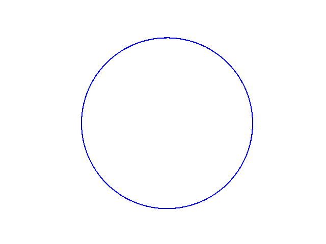

# Star-Generator
This is a project that started as an assignment for my Intro to Applied Mathematics course at the UW. I have since expanded its functionality to allow for more user customization of the stars being generated.

## Included Files:
star_builder.py - contains algorithms for star generation  
client.py - provides a more user-friendly guide through generating stars from points and skip patterns  
mass_generator.py - a simply nested loop that allows for iterative generation of similar stars (used to create the fun little animation!)  
star_bounce.gif - fun little animatio  
